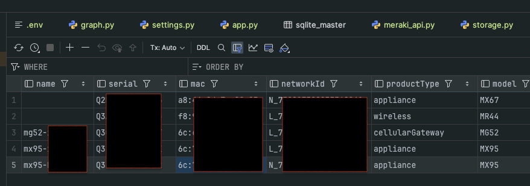
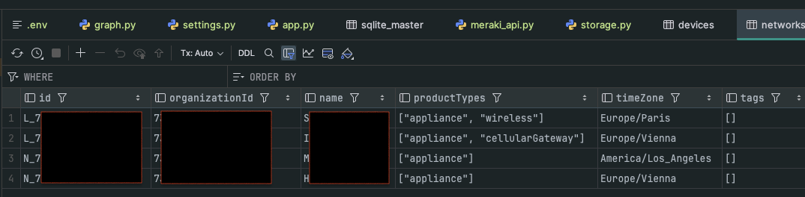
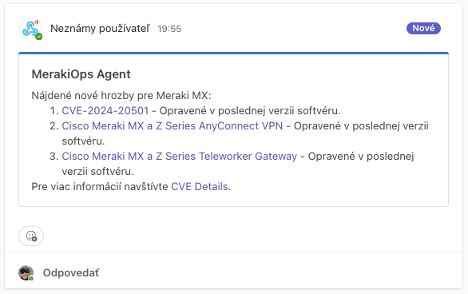

# MerakiOps ReAct Agent

Dokument popisuje rýchly štart a verifikáciu troch základných use‑cases agenta postaveného na **LangGraph (ReAct)** s Meraki API. Nepoužil som integráciu s LiteLLM, ale dávam vám na výber OpenAI API alebo lokálny ollama model. utilizácia grafu je „zabalený“ (nody/edge nevidíš, lebo sú inside prebuilt ReActu). Tzn. LangGraph bol využitý, ale nie „explicitne“.

Reťazenie vzniká vo forme START → agent → (cond) → tools → agent → … → END.

## O projekte

Agent dokáže:

- vylistovať siete a zariadenia zo zvolenej Meraki organizácie a uložiť ich do lokálnej DB (SQLite),
- získať **WAN utilisation** (uplinks usage) naprieč sieťami a uložiť výsledky,
- získať **LAN utilisation** pre **Meraki MS** (switch) – status/traffic portov za zvolený interval.

## Ukážka výstupov
### Výstup tabuľky Devices pri použití príkazu bootstrap


### Výstup tabuľky Networks pri použití príkazu bootstrap


### Výstup tabuľky wan_usage pri použití príkazu wan --hours 6


### Ukážka správy v MS Teams kanáli cez Webhook


## Požiadavky

- Python 3.11+ (odporúčané),
- [**uv**](https://docs.astral.sh/uv/) na spúšťanie (alebo použite klasický `pip`),
- Meraki API key s prístupom do danej organizácie,
- `MERAKI_ORG_ID` danej organizácie.

## Inštalácia

```bash
uv sync  # nainštaluje závislosti z requirements/pyproject
```

## Konfigurácia (.env)

V koreňovom priečinku projektu vytvor `.env` a doplň minimálne:

```
MERAKI_API_KEY=xxxx
MERAKI_ORG_ID=123456
```

> Pozn.: Projekt vie .env načítať automaticky (python‑dotenv). Pri spúšťaní cez `uv` môžeš použiť aj `--env-file .env`.

---

## Use‑cases

Nižšie sú štyri overené príkazy vrátane **skutočných výstupov** z behu.

### 1) Bootstrap – načítaj siete a zariadenia do DB

```bash
uv run -m src.app bootstrap
```

**Očakávaný výstup**:

```
Hotovo.
```

### 2) WAN utilisation za posledných 6 hodín

```bash
uv run -m src.app wan --hours 6
```

**Očakávaný výstup**:

```
WAN utilization za posledných 6 hodín bol úspešne získaný a uložený do 'wan_usage'.
```

### 3) LAN utilisation pre konkrétny switch (MS)

```bash
uv run -m src.app lan Q234-ABCD-1234 --minutes 60
```

**Očakávaný výstup** (prípad, keď zariadenie nie je MS switch):

```
Zdá sa, že zariadenie s sériovým číslom Q234-ABCD-1234 nie je podporované pre LAN využitie, pretože tento endpoint podporuje iba zariadenia Meraki MS (switch). Môžem ti pomôcť s niečím iným?
```
### 4) komunikácia s serpAPI od Google a odpoveď do MS Teams

```bash
uv run -m src.app chat "Vyhľadaj nové hrozby pre Meraki tento týždeň a pošli zhrnutie do Teams"
```
**Očakávaný výstup CLI**
```
Zhrnutie nových hrozieb pre Meraki tento týždeň bolo úspešne odoslané do Teams. Obsahovalo odkazy na relevantné stránky.
```

---

## Poznámky a tipy

- **LAN endpoint** funguje pre **Meraki MS** (switch). Pri iných typoch zariadení (MX/MR/MT/…) agent korektne vráti info, že zariadenie nie je podporované.
- **DB súbor** (SQLite) je v koreňovom priečinku projektu ako `data.sqlite3`, resp. podľa premennej `DB_PATH` v `.env`.
- Pri použití `uv` môžeš explicitne načítať `.env`:
  ```bash
  uv run --env-file .env -m src.app wan --hours 6
  ```
- Pre detailné logy pri debugovaní použi premenné prostredia:
  ```bash
  LANGCHAIN_DEBUG=1 DEBUG=1 uv run -m src.app wan --hours 6
  ```

## Overenie uložených dát (voliteľné)

Skontroluj tabuľky a počty riadkov:

```bash
uv run --env-file .env python - <<'PY'
import sqlite3
from src.settings import settings
con = sqlite3.connect(settings.db_path)
print(con.execute("SELECT name FROM sqlite_master WHERE type='table'").fetchall())
for t in ("networks","devices","wan_usage","switch_ports_usage"):
    try:
        print(t, con.execute(f"SELECT COUNT(*) FROM {t}").fetchone()[0])
    except Exception as e:
        print(t, "err:", e)
PY
```


